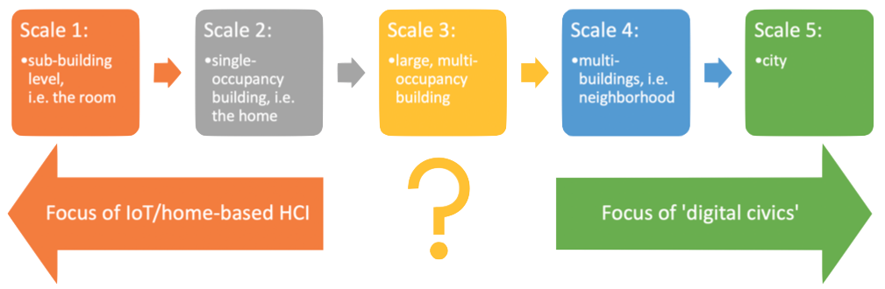

# HabiTech
## Inhabiting Buildings, Data & Technology
A full-day hybrid workshop [at CHI2024](https://chi2024.acm.org). Half-day online participation is welcome.

**11-16 May 2024, Honolulu, Hawai'i, USA.** Exact day TBA

**Submission deadline:** February 22nd, 2024

**Submissions and questions via email to:** [Jakub Krukar](mailto:krukar@uni-muenster.de) (please include 'HabiTech' in the email subject line).

Download the [full workshop paper here]("https://kubakrukar.github.io/habitech.github.io/papers/habitech2024.pdf").

## Call for Papers
We invite submissions for a workshop to help define a new research area – the building-level counterpoint to digital civics - how do new technologies enable and empower the inhabitants of a multi- occupancy buildings? This workshop will gather interdisciplinary experts in HCI, design, architecture, data ethics, and cognitive science to reflect on the role of HCI in cultivating digital civics inside buildings.

The workshop will be a rolling full-day hybrid event. Participants on-site are invited to join for the whole day. Participants in other time zones are invited to join online for the full event or for a morning/afternoon session alone.

Submissions are possible in one of two formats:

(1) a Motivational Statement highlighting professional interest in the workshop and relevant expertise (max. 2 pages, pdf files only)
(2) an Extended Abstract in the [ACM Conference Proceedings Primary Article format](https://chi2024.acm.org/submission-guides/chi-publication-formats/) (max. 4 pages excluding references) addressing any subjects related to the topic including but not limited to:

* Making the ongoing logging of user-behavior transparent, opt-in, and voluntary.
* Data interfaces embedded in architectural space.
* Encouraging the emergence of communities among
building users.
* User-driven building design, building management, and facility maintenance.
* Ethics of building-based personal data.
* Maintaining data privacy inside buildings, including
privacy-by-design.

Please see the table bewlo for a preliminary mapping of relevant concepts against those already established in digital civics. Submissions should refer to one or more of these concepts.

At least one author of each accepted paper must attend the workshop. Participants will be selected based on their prior experience, expressed interest in the workshop and the quality of their submissions. We will focus on recruiting from a diverse group of participants.

Depending on the number and quality of submissions we intend to invite the authors of Extended Abstracts to develop them either into a book chapter or a journal special issue manuscript (e.g. [Springer Series in Adaptive Environments book series](https://www.springer.com/series/15693)).

Digital Civics | HabiTech
--- | ---
The city | The building
Citizen | Building User
Citizenship | Building occupancy, residency, ‘usership’
Community | Do "building communities" exist or is it always about individual users? Who would constitute a "building community"? People who routinely share space/tasks?
Democratic engagement | Democratic engagement
Digital technologies | Digital technologies
Citizen-driven city design | User-driven building design
Ethics | Ethics
Citizen rights | Building user rights
Privacy in public space (e.g., right not to be tracked) | Privacy in buildings (e.g. right not to have one's access logs recorded?)
Equal rights to access and use public parts of the city | Equal rights to access and use public parts of the building?
Rights to healthy environments | Rights to (mentally?) healthy buildings
(Citizen) voice | (User or inhabitant’s) voice
Community-driven digital technologies | (Building) user-driven digital technologies
Community-driven digital services | (Building) user-driven digital services
Action | Building user action
City activism (offline: guerrilla gardening / digital: citizen-built public transit apps) | building activism (offline: flexibly self-rearranging space/furniture / digital: community building)
Civic potentials of digital life | Building user potentials of digital tools
volunteered geo-information | volunteered building-level information (sensors?), reporting of faults/building repairs
city data from sensors (not always volunteered) | building data from sensors (not always volunteered)

## Schedule (tentative)

**Morning session**

* 09:05 - 09:10: Welcome
* 09:10 - 10:30: Rapid fire presentations by participants
* 10:30 - 11:00: *Coffee break (‘domain-dotting’ activity over coffee)*
* 11:00 - 12:00: Brainstorming session: Identifying missing and overlapping domains
* 11:30 - 13:00: Christian Veddeler's Keynote + Discussion

* 13:00 - 14:00: *Lunch*

**Afternoon session**
* 14:00 - 15:00: Rapid fire presentations by participants
* 15:00 - 16:00: Constructive controversy exercise
* 16:00 - 16:30: *Coffee break*
* 16:30 - 17:30: Mind-mapping/mapping the domain
* 17:30 - 18:00: Reporting back and discussion about future plans

We welcome on-site and online participation from different time zones. The Morning and Afternoon sessions are complementary but it is possible to participate online in only one of them.

## Accepted papers
...will be posted here

## Organizers
**Assist. Professor Jakub Krukar**, *Institute for Geoinformatics, University of Muenster, Germany [(website)](https://krukar.staff.ifgi.de/)*. Jakub is an expert in spatial cognition - a branch of cognitive science studying how people think about, think in, and think with space. With MA in cognitive psychology, PhD in architecture, and postdoctoral experience in geoinformatics he works on bridging the gap between cognitive science and architectural practice by integrating psychological evidence with algorithmic methods for spatial design and analysis.

**Professor Ruth Conroy Dalton**, *University of Northumbria at Newcastle, UK [(website)](https://www.northumbria.ac.uk/about-us/our-staff/d/ruth-dalton/)*. Ruth Conroy Dalton is a British architect, author and Professor of Architecture at Northumbria University. Her research interests are centred on the relationship between the spatial layout of buildings and environments and their effect on how people understand and interact in those spaces. She is an expert in space syntax analysis and using virtual environments as a method for researching human factors in the built environment.

**Professor Christoph Hölscher**, *ETH Zurich and Singapore-ETH Future Cities Laboratory [(website)](https://cog.ethz.ch/people/prof--dr--christoph-hoelscher.html)*. Christoph has been Professor of Cognitive Science at ETH Zurich since 2013. Currently a member of the Singapore-ETH Future Cities Laboratory, he is also the programme director of the Future Resilient Systems programme - the second programme at the centre. His areas of research include wayfinding, spatial cognition & usability research for architectural design, HCI, user modelling & personalisation, information retrieval & web search behaviour.

**Assoc. Professor Nick Dalton**, *University of Northumbria at Newcastle, UK [(website)](https://www.northumbria.ac.uk/about-us/our-staff/d/nick-dalton/)*. Nick’s research exists in the crossover between architecture and human computer interaction. This includes areas such as space syntax in theoretical architecture. His current research area is that of very large-scale user interfaces: any user interface which is larger than a person. For example, this includes public displays, a digital wine shop, information sculptures, table-sized multitouch group interactions etc. He is a founding member of NORSC (Northumbria’s social computing research group).

**Christian Veddeler** *Architect, 3XN, Amsterdam/Copenhagen*. Christian Veddeler is an architect and a partner at 3XN Architects and leading 3XN’s emerging business in Amsterdam with a focus on design, innovation, sustainability, and entrepreneurship. Christian’s portfolio encompasses over 60 projects across Europe, the United States, and Asia.

**Professor Mikael Wiberg**, *Umeå University, Sweden [(website)](https://www.umu.se/personal/mikael-wiberg/)*. Mikael is a Professor of Informatics at Umeå university, Sweden. He is editor for the Architecture & Interaction forum for ACM Interactions, and his research interests includes a focus on interaction design at the scale of architecture, an interest in the materiality of interaction, and an interest in concept-driven design methods. He is the author of a recent book, "The Materiality of Interaction - Notes on the Materials of Interaction Design" (MIT Press, Jan 2018).

## Institutions

